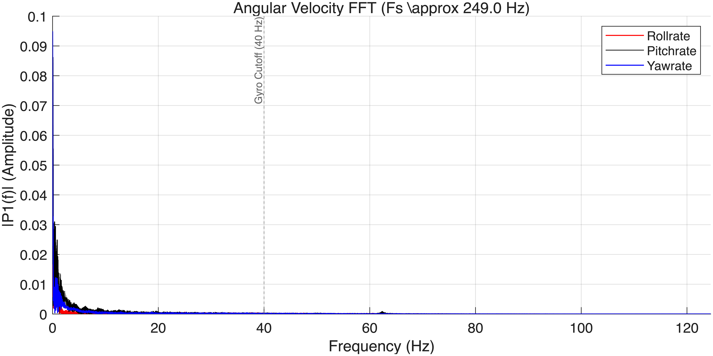
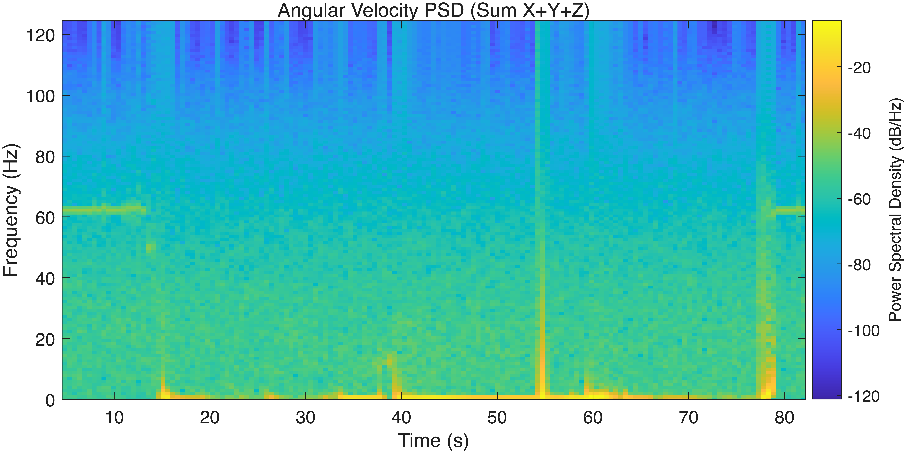
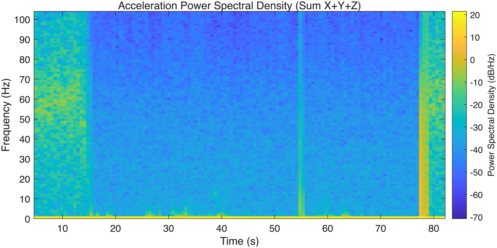
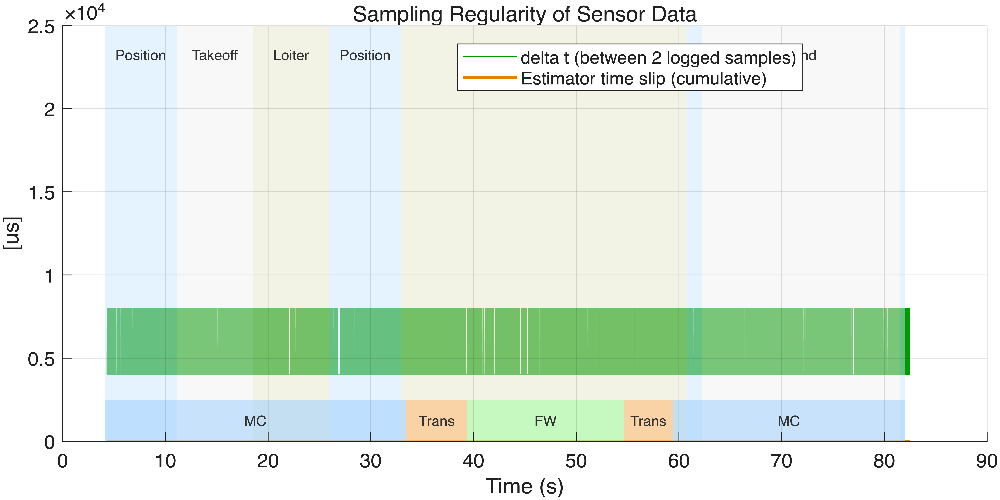

# PX4_ulog_plottools

## About

This is a tiny MATLAB plotting tool for PX4 ULog data, inspired by [matulog](https://github.com/CarlOlsson/matulog).
It allows you to customize and visualize the signals you are interested in. This tool has been tested on macOS and Windows 10, using MATLAB. Early versions can be obtained from [SCUT-DuctedFan](https://github.com/SCUT-DuctedFan/ulog_matlab_plot.git).

## Requirements
1. MATLAB
2. Python (installed and accessible from the system PATH)
3. [pyulog](https://github.com/PX4/pyulog) — required for running ulog_matlab_plot

You can install [pyulog](https://github.com/PX4/pyulog) via:

```sh
pip install pyulog # pip3 install pyulog
```

For more details, please see `https://github.com/PX4/pyulog`. In that case, you can locate the ulog2csv tool with:

```
which ulog2csv
```

## Usage
1. Clone or download this repository.
2. Copy your `.ulg` files to `/data`
3. Open `load_data_main.m` in MATLAB and modify the **User Configuration Area**:

```matlab
% --- User Configuration Area ---------------------------------------------------------
% Specify filename here (can be relative path 'data/09_49_18' or absolute path)
% [KEY]: If left empty (i.e. specifiedFileName = '';), a dialog will pop up for selection when the script runs.
specifiedFileName = 'data/09_49_18'; % Supports with or without extension
```

Where `09_49_18` is the file name of ulog.

4. Run the main plotting script `plot_setpoint_response.m`.
   
## Result
An example of plotting the flight log of a dual tailsitter:












## Notes

If you see the following warning when installing or running pyulog, it means the installation path is not on your system PATH variable:

WARNING: The scripts ulog2csv, ulog2kml, ulog2rosbag, ulog_extract_gps_dump, 
ulog_info, ulog_messages, ulog_migratedb, and ulog_params are installed in 
'/Users/mch/Library/Python/3.8/bin' which is not on PATH.
Consider adding this directory to PATH or, if you prefer to suppress this warning,
use --no-warn-script-location.

Simply add the shown directory to your PATH or ignore the warning if you prefer.

