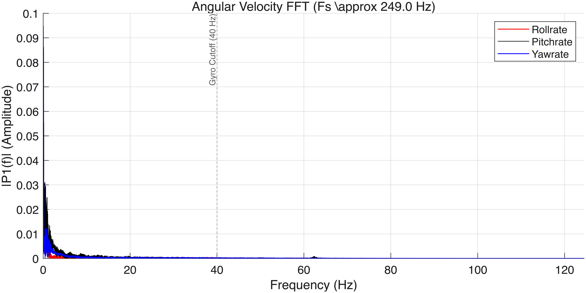
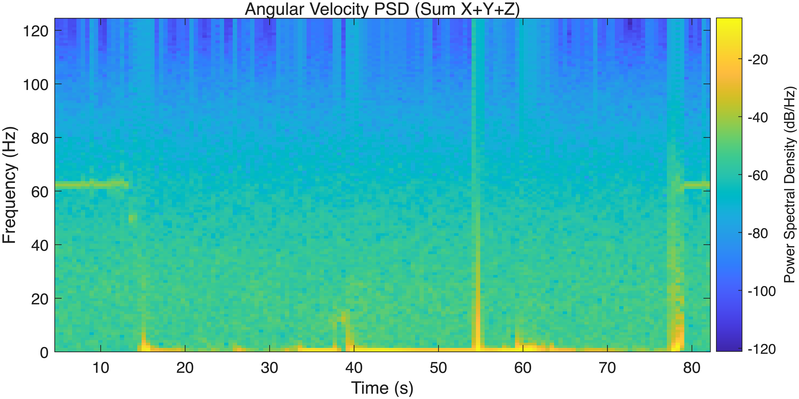
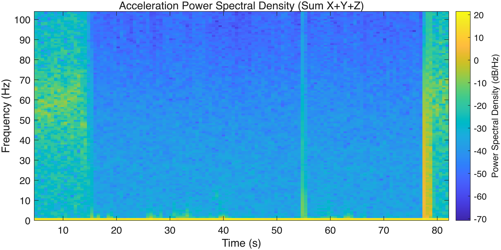
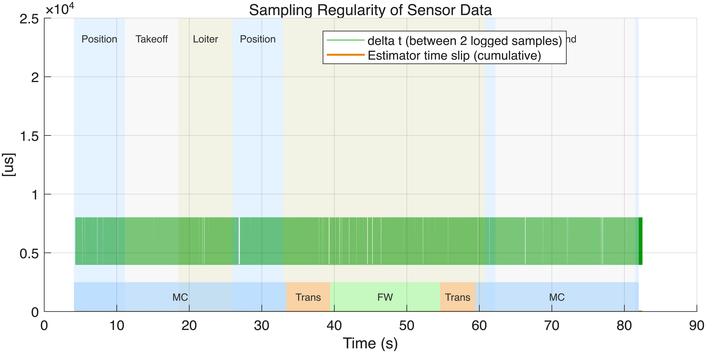

# PX4_ulog_plottools

## About

This is a tiny MATLAB plotting tool for PX4 ULog data, inspired by [matulog](https://github.com/CarlOlsson/matulog).
It allows you to customize and visualize the signals you are interested in. This tool has been tested on macOS and Windows 10, using MATLAB. Early versions can be obtained from [SCUT-DuctedFan](https://github.com/SCUT-DuctedFan/ulog_matlab_plot.git).

## Requirements
1. MATLAB

The Python environment is managed automatically by the project. No separate Python or pyulog installation is required.

## Usage
1. Clone or download this repository.
2. Copy your `.ulg` files to `/data`

### First-time setup

For the first use, initialize the required environment:

Windows:

```powershell
.\scripts\setup_env.ps1
```

Linux:

```sh
./scripts/setup_env.sh
```

macOS:

```sh
./scripts/setup_env_macos.sh
```

3. Open `load_data_main.m` in MATLAB and modify the **User Configuration Area**:

```matlab
% --- User Configuration Area ---------------------------------------------------------
% Specify filename here (can be relative path 'data/09_49_18' or absolute path)
% [KEY]: If left empty (i.e. specifiedFileName = '';), a dialog will pop up for selection when the script runs.
specifiedFileName = 'data/09_49_18'; % Supports with or without extension
```

Where `09_49_18` is the file name of ulog.

4. Run the main plotting script `plot_setpoint_response.m`.
   
## Result
An example of plotting the flight log of a dual tailsitter:










